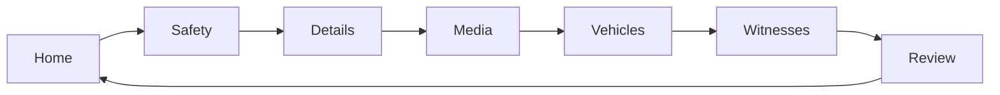

# CrashPad UI/UX suggestions

Prioritized UI/UX suggestions for CrashPad, based on the current home screen and the safety → details → media → vehicles → witnesses → review flow. These are recommendations, not an implementation commitment.

The app is a phone-first crash report: home, then a six-step form ([safety](app/screens/safety.tsx) → [details](app/screens/details.tsx) → [media](app/screens/media.tsx) → [vehicles](app/screens/vehicles.tsx) → [witnesses](app/screens/witnesses.tsx) → [review](app/screens/review.tsx)), then a saved collision. The visual system in [app/globals.css](app/globals.css) is already consistent. The gaps are in wayfinding, roadside scanning, and a few controls that fight each other.

## Do these first

**1. Show progress on the report.** Every step footer is only “Next” or “Save Changes”. Someone filling this out after a crash cannot tell that witnesses is step 5 of 6. Add a compact step indicator in [ScreenContainer](components/ScreenContainer.tsx) for `/collisions/form/*` (Safety, Details, Media, Vehicles, Witnesses, Review). Keep the existing titles.

**2. Give home one primary action.** [home.tsx](app/screens/home.tsx) can show an install banner, “Add My Vehicle”, “Add Collision”, and a floating + that does the same thing as “Add Collision”. The empty collision copy in [CollisionList](components/CollisionList.tsx) says “Great news! You haven’t recorded any collisions yet,” which treats the app’s job as something to celebrate avoiding. Use one start button, drop the duplicate +, and say what the app is for: record a collision when it happens. Saving “My Vehicle” stays secondary.

**3. Label the saved vehicle.** [collisionFormStore.ts](store/collisionFormStore.ts) already inserts the home vehicle into a new report, but [VehicleCard](components/VehicleCard.tsx) still says “Vehicle 1”. Mark that card “Your vehicle” so the prefill is obvious, and keep + for other vehicles.

**4. Put location errors in the page, and make GPS useful.** [details.tsx](app/screens/details.tsx) uses `window.alert` for a denied permission, and other geolocation failures do nothing. Show the failure under the location field. When coordinates exist, offer “Open in Maps” instead of only `43.76120, -79.41100`.

**5. Make delete dialogs name the action.** [Dialog](components/Dialog.tsx) confirms deletes with “Yes” / “No”. Use “Delete” and “Cancel”. Media in [Media.tsx](components/Media.tsx) deletes immediately with no confirm, while vehicles and witnesses ask first. Photos are the evidence; confirm those too.

**6. Make review scannable.** [CollisionInfoView](components/CollisionInfoView.tsx) and vehicle/witness cards are “Label: value” paragraphs. On the review and collision screens, lead with plate, make/model/color, and driver name/phone. Show the date once (“Wed, Oct 7, 3:42 PM”) instead of `toDateString()` plus a separate time line.

## Worth doing next

**7. Replace floating + with a footer action on list steps.** Vehicles and witnesses already have a sticky footer, and the + in [globals.css](app/globals.css) sits over the last card (`.shell-body` padding is `1.25rem`; the button is 56px). A footer “Add vehicle” / “Add witness” is easier to hit and does not cover the list. Home can use the same pattern.

**8. “Save Draft” should say it leaves the form.** [CollisionDraftButton](components/CollisionDraftButton.tsx) saves, then a dialog, then sends you home. Label it “Save & exit”, or save and leave with a short confirmation on home (the Draft badge on [CollisionCard](components/CollisionCard.tsx) already exists).

**9. Scroll to the first invalid field.** Details and vehicle forms set errors and stay put. On a phone the error is often above the footer the user just tapped. Focus the first `.field.error` after a failed Next / Save.

**10. Shorten the splash.** [AppShell](components/AppShell.tsx) holds the splash for at least 2 seconds even when storage is already open. Show it only while storage is loading.

## Smaller polish

- **Form labels.** Details labels include the example (`Where are you? (Ex. "near Jane and Finch")`). Use a short label and put the example in placeholder or helper text in [Field](components/Field.tsx).
- **Collision cards.** [CollisionCard](components/CollisionCard.tsx) is an `article` with `role="button"` that only handles Enter. Use a real button (or handle Space) and a pointer cursor.
- **Dialog behavior.** Focus the dialog on open, close on Escape, and return focus to the control that opened it.
- **Theme toggle.** [ThemeToggle](components/ThemeToggle.tsx) sits in every report header. Keep it on home; the report header only needs back and the step title.
- **Media empty state.** The camera/library card and a second “No media added” card say the same thing. Keep the buttons; drop the extra empty card on the media step.
- **Install hint.** It is fine, but it should not sit above both empty states as a third banner. After dismiss, don’t bring it back in the same session (that part already works).

