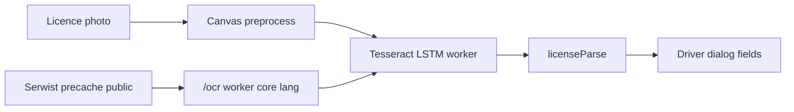

# Offline licence OCR in the Driver dialog

Add an offline Tesseract.js LSTM scan on the Driver dialog that reads an Ontario licence photo, fills name / licence / address, and relies on Serwist’s existing public-asset precache so it works with no network.

## Todos

- [ ] Add tesseract.js, vendor-ocr script, LSTM cores + worker + eng.traineddata.gz under public/ocr, CSP wasm-unsafe-eval
- [ ] licenseParse + licenseOcr (canvas preprocess, OEM 1, self-hosted paths, no IDB)
- [ ] Camera/library scan on DriverDialog; merge fields; errors; terminate worker on close
- [ ] scripts/ocr-check.mjs on synthetic dumps; hook into npm run build

## Why Tesseract.js LSTM

The tree already has LSTM-only cores under [`public/ocr/core/`](public/ocr/core/). That is the lightest accurate engine that can ship as static files and be served by Serwist with no CDN.

Skip heavier options (ONNX RapidOCR, Transformers.js): extra WASM runtime, larger models, messier CSP. Skip PDF417 on the card back: more accurate for structured data, but it is not OCR and is a different camera target.

**Ceiling (call out in a `ponytail:` comment):** phone photos of glossy bilingual cards will misread. The user always reviews fields before Save. Upgrade path: PDF417 on the back, or a larger rec model.

Phone is **not** on an Ontario licence. OCR fills `name`, `license`, and `address` only; `phoneNumber` is left as-is.

## Offline packaging (Serwist)

[`serwist.config.mjs`](serwist.config.mjs) already precaches `public/**/*`. Put every Tesseract file under `public/ocr/` and they are available offline after install.

Add **`tesseract.js`** (API only). Vendor the runtime files so the worker never hits a CDN:

- `public/ocr/worker.min.js` ← `tesseract.js/dist/worker.min.js`
- `public/ocr/core/` ← LSTM cores from `tesseract.js-core` (keep the three already present: `*-lstm`, `*-simd-lstm`, `*-relaxedsimd-lstm`). Do **not** vendor the legacy non-LSTM cores.
- `public/ocr/lang/eng.traineddata.gz` ← tessdata 4.0.0 English (Tesseract.js default; ~2MB gzipped)

Small [`scripts/vendor-ocr.mjs`](scripts/vendor-ocr.mjs) copies worker + cores from `node_modules` so versions stay aligned. Fail if `eng.traineddata.gz` is missing (that file is not on npm; keep it in `public/ocr/lang/`). Run it at the start of `build` / `dev` so Serwist sees the files.

Worker options (no blob worker — CSP is `worker-src 'self'`):

```ts
createWorker("eng", 1, {
  workerPath: "/ocr/worker.min.js",
  corePath: "/ocr/core",
  langPath: "/ocr/lang",
  workerBlobURL: false,
  gzip: true,
  cacheMethod: "none",
});
```

OEM `1` = LSTM only, so Tesseract only fetches the LSTM cores already in the tree.

CSP in [`next.config.ts`](next.config.ts): add `'wasm-unsafe-eval'` to `script-src` so the Emscripten cores can instantiate WASM. Keep `worker-src 'self'`.

## Read + parse

Two small modules; parser has no Tesseract dependency.

1. [`lib/licenseOcr.ts`](lib/licenseOcr.ts) — client-only. Dynamic `import("tesseract.js")` on first scan. Load the image on a canvas (max width ~1600, grayscale). `recognize`, then terminate the worker when the dialog unmounts. Do **not** write the photo to IndexedDB.

2. [`lib/licenseParse.ts`](lib/licenseParse.ts) — map OCR text to a partial `Driver` for Ontario cards:
   - Licence: `[A-Za-z]\d{4}-?\d{5}-?\d{5}` → `maskValue(LICENSE_MASK, …)` from [`lib/mask.ts`](lib/mask.ts)
   - Drop header/label noise (`ONTARIO`, `PERMIS`, `DOB`, `CLASS`, …)
   - Name: remaining name-like lines before the address
   - Address: street line through Canadian postal code
   - Ignore phone

If nothing useful is parsed, return an error string; do not wipe fields the user already typed. Partial hits fill only those keys.

One assert check [`scripts/ocr-check.mjs`](scripts/ocr-check.mjs) with a couple of synthetic OCR dumps (happy path + garbage). Wire it into the `build` script like the other `check:*` tasks.

## Driver dialog UI

In [`components/DriverDialog.tsx`](components/DriverDialog.tsx), same hidden-file pattern as [`components/Media.tsx`](components/Media.tsx):

- `accept="image/*"` camera (`capture="environment"`) + library
- Buttons at the top of the dialog (“Camera” / “Library”), busy label while reading
- On success, merge parsed fields into local `driver` state; user still hits Save
- On failure (HEIC that the canvas cannot decode, empty parse, worker error), show a short message via the existing error pattern; camera on iOS is JPEG, library HEIC may fail — treat that as the known ceiling, no extra decoder

Reuse Lucide `Camera` / `Images` icons. No new UI kit, no stored thumbnail.



## Out of scope

- Storing the licence image
- Filling phone
- PDF417 / barcode on the back
- Changing `driverSchema` or vehicle save flow
