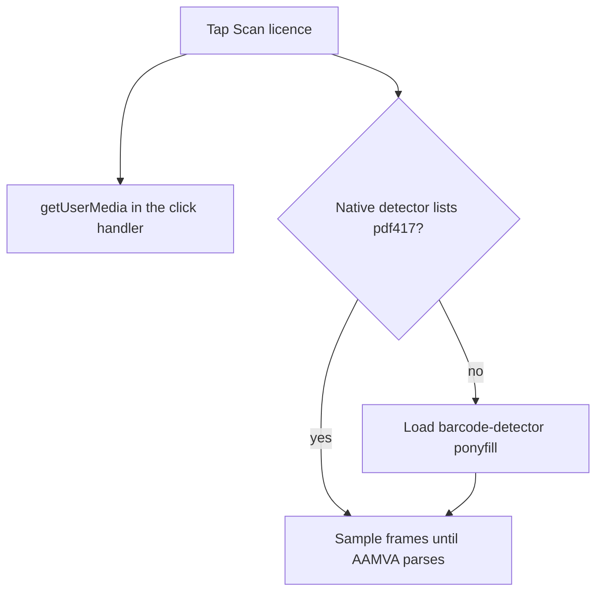

# Safari PDF417 WASM fallback

Keep the native PDF417 detector where the browser has it, and fall back to a self-hosted ZXing WASM reader so Safari can scan the same licence barcode offline.

Chrome already scans the licence barcode through the native `BarcodeDetector` in [`components/DriverDialog.tsx`](components/DriverDialog.tsx). Safari does not implement that API, so the button stops at “This browser can't scan a licence barcode.” The parser in [`lib/aamva.ts`](lib/aamva.ts) stays as it is; only detection changes.

## Decoder

Add the `barcode-detector` package (ZXing-C++ reader WASM, PDF417 included). Use the ponyfill, not the polyfill, so `window.BarcodeDetector` is left alone.

- Native path stays first: `getSupportedFormats()` includes `"pdf417"` means no WASM download.
- Otherwise dynamically import `barcode-detector/ponyfill` and point `prepareZXingModule` at a same-origin file. The package’s default is a jsDelivr URL, which this app cannot use: [`next.config.ts`](next.config.ts) sets `connect-src 'self'`, and the README promises no third-party scripts. The reader binary is about 1 MB; the full build is not needed.

[`lib/barcode.ts`](lib/barcode.ts) owns that choice:

- `zxingWasmUrl(path, prefix)` returns `/zxing/zxing_reader.wasm` for a `.wasm` path.
- `pickDetector` returns the native constructor when PDF417 is listed, otherwise the WASM one.
- `openPdf417Detector()` wires the real `window.BarcodeDetector` and the dynamic import. Both detectors expose `detect()` with `rawValue`, so the scan loop stays one path.

## Hosting the binary

A copy script (called at the start of `dev`, `dev:once`, and `build`) copies `zxing-wasm/dist/reader/zxing_reader.wasm` from `node_modules` into `public/zxing/zxing_reader.wasm`, then checks its SHA-256 against `ZXING_WASM_SHA256`. The file is generated, so add `/public/zxing/` to [`.gitignore`](.gitignore).

- [`next.config.ts`](next.config.ts): add `'wasm-unsafe-eval'` to `script-src`. Without it, production CSP refuses to compile the module (`'unsafe-eval'` in dev already covers that case).
- [`serwist.config.mjs`](serwist.config.mjs): precache `/zxing/zxing_reader.wasm` with a content-hash revision so an installed PWA can scan with no network. `connect-src 'self'` already allows the fetch.

## Scan UI

In [`components/DriverDialog.tsx`](components/DriverDialog.tsx):

- On tap, call `getUserMedia({ video: { facingMode: { ideal: "environment" } }, audio: false })` immediately, then open the scan view with that promise. iOS Safari drops the permission if the camera request waits on an `await` (today that await is `canScanPdf417()`, and the request itself runs in an effect). Cleanup must stop tracks if the user cancels before the promise resolves.
- Load the detector in parallel. Camera failure keeps the existing “Camera permission is needed” message. Detector failure keeps the existing “can't scan” message.
- Native frames: `detect(video)` as now, every 200ms, skipping overlapping calls.
- WASM frames: draw the current frame into one reused canvas, longest side capped at 1280, and `detect` that. Full phone resolution makes PDF417 WASM miss the interval and run hot. Mark that cap with a `ponytail:` comment.

## Check

[`scripts/barcode-check.mjs`](scripts/barcode-check.mjs), wired into `npm run build` like the other checks: native formats containing `pdf417` win; any other result, throw, or missing native detector selects the WASM stand-in; `zxingWasmUrl` maps only `.wasm` paths onto `/zxing/zxing_reader.wasm`.

## Verify

After `npm run dev`, confirm the response headers include `wasm-unsafe-eval`, `/zxing/zxing_reader.wasm` is `200` with `application/wasm`, and a browser that has native PDF417 still opens the camera and scans. This environment cannot run Safari; the iOS check is a real device pointing at the barcode on the back of a licence, including the first-visit permission prompt.

## Tasks

- Add barcode-detector, copy zxing_reader.wasm into public/zxing, gitignore it, precache it, allow wasm-unsafe-eval
- Add lib/barcode.ts: native PDF417 first, else same-origin WASM ponyfill
- Start the camera inside the tap and scan with the chosen detector, downscaling WASM frames
- Add scripts/barcode-check.mjs and run it from the build script
