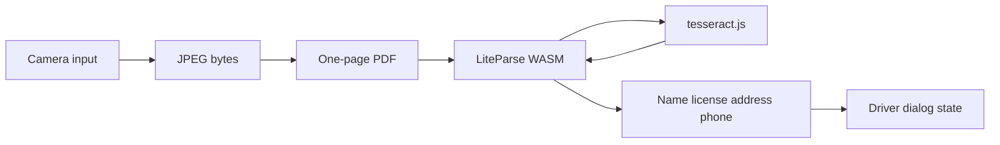

# Scan a driver's licence into the driver dialog

Add a Scan licence button to the driver dialog that captures a photo on the device, reads it with LiteParse WASM plus a local OCR engine, and fills the form fields when a licence is recognized. Nothing is uploaded, and the parser assets are precached so it works offline.

The dialog in [components/DriverDialog.tsx](components/DriverDialog.tsx) is the only place this lands. Capture follows the existing camera control in [components/Media.tsx](components/Media.tsx): a hidden `<input type="file" accept="image/*" capture="environment">`. That opens the camera on a phone and stays inside the app. The photo is used in memory and not saved with the collision.

## Why it is not a server call

`@llamaindex/liteparse-wasm` runs in the browser and only accepts PDF bytes. Its WASM build has no Tesseract and no image converter. A camera photo is a JPEG, so the client will:

1. Draw the photo and embed the JPEG in a one-page PDF (a small writer in `lib/`, no new PDF library).
2. Parse that PDF with LiteParse (`ocrEnabled: true`).
3. When LiteParse asks for OCR, run `tesseract.js` on the PNG it passes in and return word boxes `{ text, bbox, confidence }`.
4. Map `result.text` onto the driver fields.

`tesseract.js` is the on-device engine LiteParse calls. It is not a cloud OCR service. Both WASM modules and `eng.traineddata` are served from this origin and precached by the service worker.

## UI

In `DriverDialogForm`, above the name field:

- A full-width outline button, Camera icon, label **Scan licence**. Disabled with "Reading licence…" while a scan is in progress.
- On success, merge only the fields that were read into the existing form state (a licence photo usually has no phone; a phone the user already typed stays).
- On failure (cancel, unreadable photo, no name and no licence number), leave the form as it is and show a short error under the button. Save still validates with `driverSchema`.

## Field parser

`lib/licenseScan.ts` holds the pure text mapping, separate from WASM:

- Licence: Ontario pattern already implied by `LICENSE_MASK` in [lib/mask.ts](lib/mask.ts) (`A9999-99999-99999`), then `maskValue`.
- Name: a `SURNAME, GIVEN NAMES` line, title-cased to `Given Names Surname`.
- Address: the street and city lines that follow the name.
- Phone: only if a phone-shaped string is present, then `PHONE_MASK`.
- Success means a licence number or a name was found. Otherwise return a failure and do not touch the form.

`ponytail:` comment on the parser: it expects a printed Ontario-style card in English, not a handwritten or out-of-province layout.

`scripts/license-scan-check.mjs` asserts one sample card text and one garbage string. Wire it into the `build` script next to the other checks.

## Offline assets and CSP

- Dependencies: `@llamaindex/liteparse-wasm` and `tesseract.js` (pulls `tesseract.js-core`).
- Load LiteParse with `init(new URL("@llamaindex/liteparse-wasm/liteparse_wasm_bg.wasm", import.meta.url))` so the bundler emits the wasm into the Next static output, which Serwist already precaches.
- Copy the tesseract worker, core wasm, and `eng.traineddata` into `public/ocr/` and point `createWorker` at those paths (`gzip: false`, no CDN). Add those URLs to `additionalPrecacheEntries` in [serwist.config.mjs](serwist.config.mjs).
- In [next.config.ts](next.config.ts), add `'wasm-unsafe-eval'` to `script-src` so Chrome will instantiate WASM under the existing CSP. `connect-src 'self'` stays; no new hosts. If the tesseract worker is blocked, add `blob:` to `worker-src` only if the browser requires it.

The scan module is dynamically imported from the button click so the home screen does not load either wasm until someone scans. Keep one worker/parser pair for the session so a second scan does not reload the models.

## Check

After implementation, confirm in the browser that the dialog button opens the camera input, a scan error does not wipe typed fields, and a successful parse fills name and licence. The text parser is covered by the node check; a live camera photo still depends on the device.

## Tasks

- Add liteparse-wasm and tesseract.js, vendor public/ocr assets, precache them, allow wasm-unsafe-eval
- JPEG-to-PDF wrapper plus Ontario licence text parser and scripts/license-scan-check.mjs
- Client scan module: LiteParse WASM parse with a tesseract.js ocrEngine
- Scan licence button in DriverDialog that fills the form only on success
